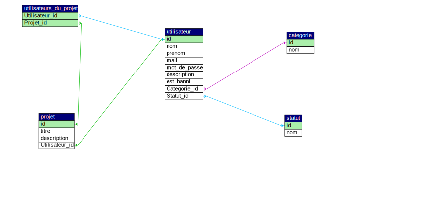

# projeception

Ceci est un projet consistant à concevoir un logiciel permettant de gérer les différents projets d'Open Innovation des étudiants de l'EPSI

## Groupe sur le projet

----------------------------

- Kevin LEBEAU : <https://github.com/kevmorlo>
- Augustin DUVAL : <https://github.com/Flys3r>

## Langages utilisés

----------------------------

- PHP
- HTML
- CSS

    Modèle physique de données :

  

## Framework utilisés

Aucun framework utilisé pour ce projet

## Contenu

#TODO

## Aperçu

#TODO

## Responsive ?

Le projet est adapté pour les plateformes mobiles, tablettes et ordinateurs (sauf 4K)

## Installation du projet

### Prérequis

- Un serveur web (php, apache, mysql/mariadb)
- Composer
- Node (facultatif)

### Installation

1. Importez les dépendances Composer du projet avec la commande : 
```bash
composer install
```

2. (Optionnel) Pour pouvoir modifier les styles du projet, installez les dépendances de Node avec la commande : 
```bash
npm install
```

3. (Optionnel) Pour lancer le compilateur de Sass, tapez la commande : 
```bash
npm run watch
```

4. Vous devez importer le fichier sql présent dans le dossier database dans votre base de données.

5. Lancez le serveur.

## License

Ce projet est protégé par la license Apache 2.0.
